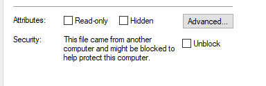

# KeePass 2.54 Enforced XML Configuration Templates

I was tasked to enforce KeePass settings for my workplace, and I need to see settings that are not configurable via the user interface, as described in the [Enforced Configuration](https://keepass.info/help/kb/config_enf.html) article.

# Notes on How I Generated the Template

- Downloaded KeePass (I chose the portable download)

- Ran the Developer Command Prompt via Visual Studio (Tools > Command Line > Developer Command Prompt)
  - `xsd.exe` was available via a regular command prompt; like it's part of the PATH, I think
  - Running as admin may or may not be required

- Attempted to run:  `Xsd.exe KeePass.exe /type:KeePass.App.Configuration.AppConfigEx`

- Got the following error:
  >  Error:  Could not load file or assembly 'LOCATION OF FILE' or one of its dependencies.  Operation is not supported.  (Exception from HRESULT:  0X80131515). - An attempt was made to load an assembly from a network location which would have caused the assembly to be sandboxed in previous version of the >NET framework.  This release of the .NET framework does not enable CAS policy by default, so this load may be dangerous.  If this load is not intended to sandbox the assembly, please enable the loadFromeRemotSource switch.

- After a great deal of effort and searching online, it seems like you have to "Unblock" `KeePassLibC32.dll` and `KeePassLibC64.dll` to get `xsd.exe` to work.  These were in the same directory as KeePass.

  

- Eventually got `xsd.exe` to create `schema0.xsd`; then, I had mistakenly created a C# class thinking this would generate the XML template
  - `xsd.exe /c YourSchema.xsd`
  - created the `schema0.cs` class
  - did nothing for me, but was cool to look at

- Opened `schema0.xsd` file in Visual Studio
    - Found the root node
    - right-click, choose "Generate Sample XML File"
